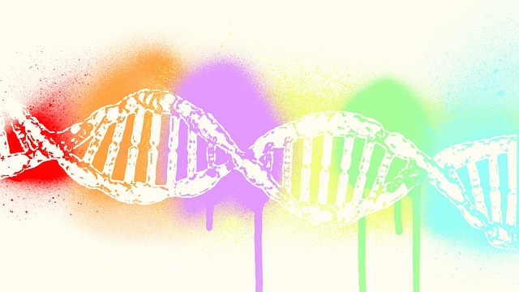
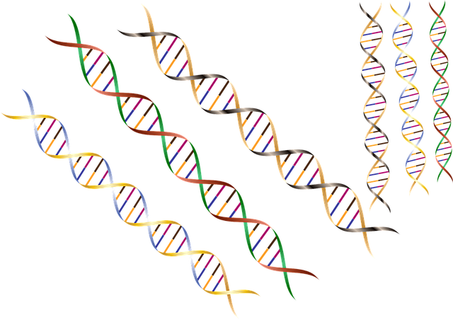

# Proyecto2Programacion20191
Proyecto del segundo corte de la unidad  de programación

# Las Secuencias de ADN

Una cadena de ADN esta formada por bases de Adenina, Guanina, Citocina y
Tiamina 'A, T, C, G', adicionalmente las cadenas de ADN se organizan en
pares enlazados los cuales deben ser complementados de la siguiente
forma A <-> T y C <-> G.

El objetivo de esta aplicación es evaluar si dos cadenas de ADN son
Correspondientes y adicionalmente obtener la cadena complementaria.

Finalmente se desea evaluar el nivel de correspondecia entre una cadena y una
no valida.

# 
## Se recomienda dividir el problema en partes mas simples:

1. La función obtener complento que retorna el complemento de una base

1. La función para generar la cadena complementaria

1. La función para validar una base

1. La función para calcular el porcentaje de correspondencia de una cadena y otra

1. La función que nos valida la correspondencia entre dos cadenas

1. La función para validar si todos las bases son validas en la cadena

1. La función es base

### ¿Que hacer Despues?

* Mejora utilice las funciones creadas para leer cadenas de ADN
de un archivo y validar sus complementos

* Evalue el nivel de correspondencia de las cadenas en 
su archivo para detectar anomalias geneticas

